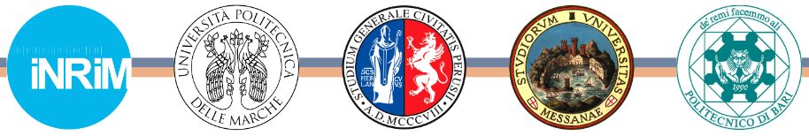

.. role:: raw-html(raw)
    :format: html

.. role:: py(code)
   :language: python

BTTCAL
==========

This repository contains open-source data, results, and dissemination from the National Research Project "Development of calibration procedures of Tip Timing systems for non-contact turbine blade vibration measurements". BTTCAL is funded by the Italian Ministry of University and Research (MUR). Grant id is J53D23002440006 (PRIN2022).

-------------

The overarching goal of the project is...
The Principal investigator is Prof. `Gianluca Rossi`_ from the Univeristy of Perugia, supported by:

- Prof. `Nicola Paone`_, Marche Polytechnic University
- Prof. `Roberto Montanini`_, University of Messina
- Prof. `Laura Fabbiano`_, Polytechnic of Bari
- dr. `Alessandro Schiavi`_, National Metrology Institute of Italy

Sub-steps
--------
- aaa
- bbb
- ccc

References
----------

.. _Gianluca Rossi: https://www.unipg.it/personale/gianluca.rossi
.. _Nicola Paone: https://www.univpm.it/Entra/Engine/RAServePG.php/P/320710010421/idsel/260/docname/NICOLA%20PAONE
.. _Roberto Montanini: https://archivio.unime.it/it/persona/roberto-montanini
.. _Laura Fabbiano: https://www.dmmm.poliba.it/index.php/it/profile/fabbiano
.. _Alessandro Schiavi: https://www.inrim.it/it/rubrica/alessandro-schiavi

